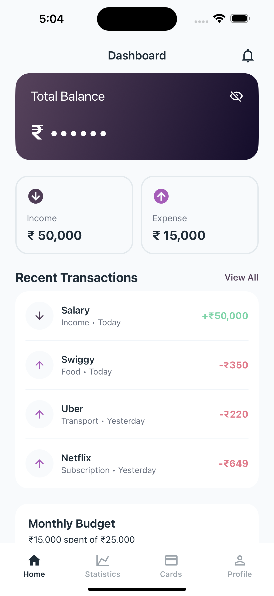
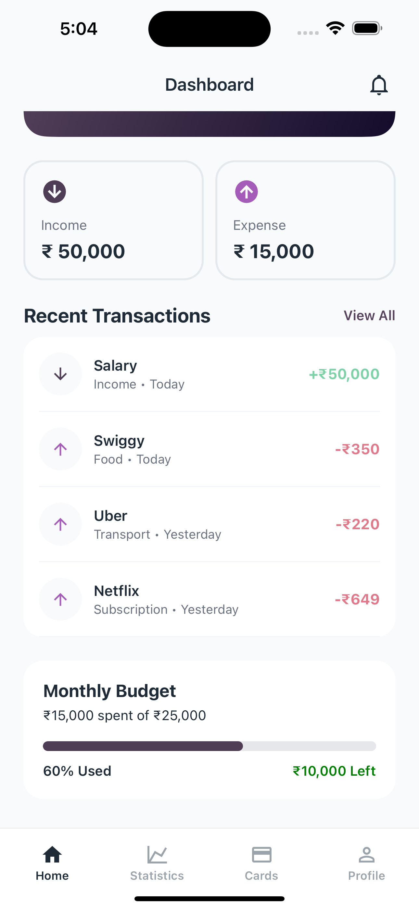
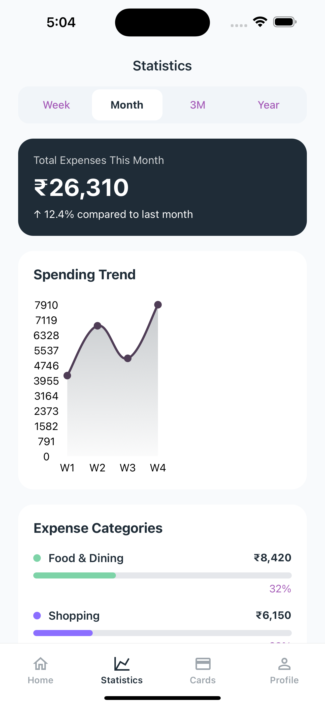
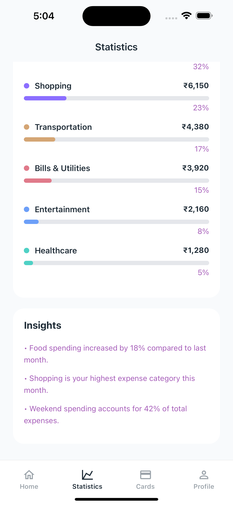
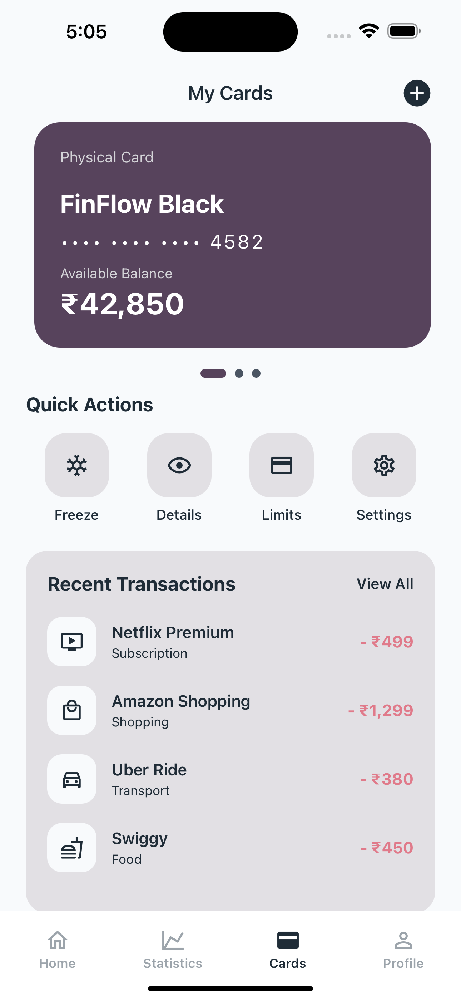
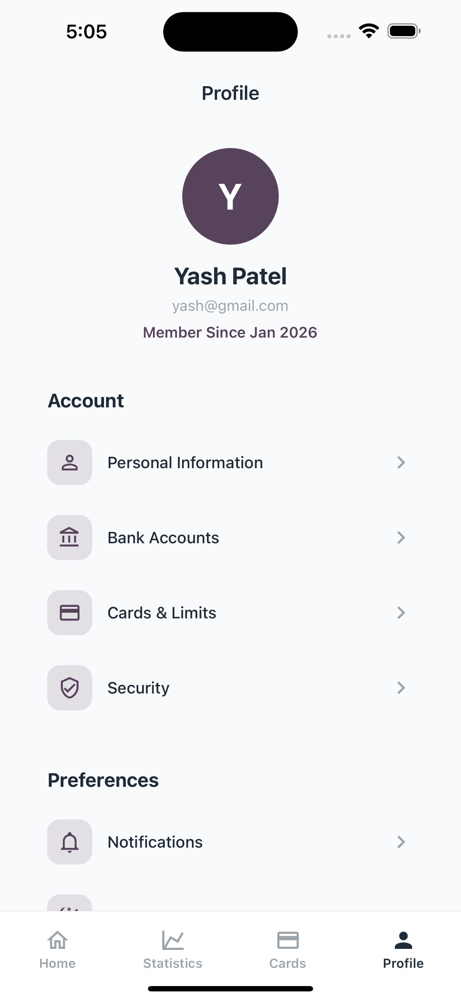
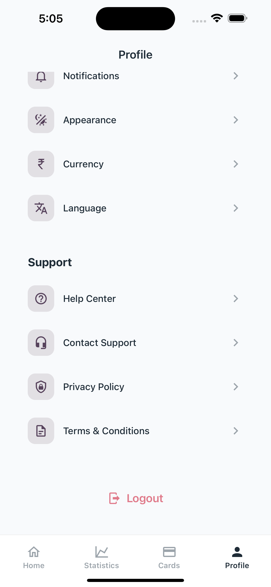

# FinFlow 💰

A modern Personal Finance Manager mobile application built with React Native and TypeScript.

FinFlow helps users track expenses, monitor spending habits, manage payment cards, and visualize financial data through a clean and scalable mobile experience.

---

## 📱 Overview

FinFlow is a portfolio project focused on demonstrating professional React Native development practices, including:

- TypeScript
- Redux Toolkit
- API Integration
- Scalable Project Structure
- Reusable Components
- Navigation Architecture
- Modern UI Design

---

## ✨ Features

### 🏠 Dashboard
- Balance overview
- Income & expense summary
- Recent transactions
- Budget progress tracking
- Quick financial insights

### 📊 Statistics
- Weekly, Monthly, and Yearly filters
- Spending trend charts
- Expense category breakdown
- Financial analytics

### 💳 Cards
- Interactive card carousel
- Multiple card management
- Card-related quick actions
- Recent card transactions

### 👤 Profile
- User profile information
- App preferences
- Security settings
- Notification settings
- Support & help section

---

## 🛠 Tech Stack

### Core

- React Native
- TypeScript

### State Management

- Redux Toolkit
- React Redux

### Navigation

- React Navigation
- Bottom Tab Navigation
- Native Stack Navigation

### Networking

- Axios

### UI Libraries

- React Native Vector Icons
- React Native Linear Gradient
- React Native Safe Area Context
- React Native Screens

---

## 📂 Project Structure

```text
src
├── api
│   ├── client.ts
│   └── endpoints.ts
│
├── assets
│   ├── colors
│   ├── images
│   └── fonts
│
├── components
│   ├── Header.tsx
│   ├── Container.tsx
│   ├── ScreenContent.tsx
│   ├── TransactionItem.tsx
│   └── BudgetProgress.tsx
│
├── navigation
│   ├── AppNavigator.tsx
│   ├── RootNavigator.tsx
│   ├── MainTabNavigator.tsx
│   └── types.ts
│
├── screens
│   ├── HomeScreen.tsx
│   ├── StatisticsScreen.tsx
│   ├── CardsScreen.tsx
│   └── ProfileScreen.tsx
│
├── services
│   ├── transactionService.ts
│   ├── cardService.ts
│   └── profileService.ts
│
├── store
│   ├── hooks.ts
│   ├── index.ts
│   └── slices
│       ├── transactionSlice.ts
│       ├── cardSlice.ts
│       └── profileSlice.ts
│
├── utils
│
└── types
```

---

## 🔄 State Management

Redux Toolkit is used for scalable and maintainable state management.

Implemented with:

- configureStore
- createSlice
- createAsyncThunk
- Typed Hooks
- Async API Handling

Example flow:

```text
Screen
   ↓
Dispatch Action
   ↓
createAsyncThunk
   ↓
Service Layer
   ↓
API
   ↓
Redux Store
   ↓
UI Update
```

---

## 🌐 API Architecture

The application follows a service-based API architecture.

Example:

```text
Screen
   ↓
Redux Thunk
   ↓
Service Layer
   ↓
Axios Client
   ↓
Backend API
```

Benefits:

- Separation of concerns
- Easy testing
- Reusable API methods
- Cleaner screens

---

## 🎨 Design Principles

The application focuses on:

- Clean Fintech UI
- Dark Theme Experience
- Reusable Components
- Consistent Spacing System
- Mobile-first Design
- Smooth User Experience

---

## 🚀 Getting Started

### Clone Repository

```bash
git clone git@github.com:YPATEL04/finflow-react-native.git
```

### Install Dependencies

```bash
yarn
```

### Install iOS Pods

```bash
cd ios
pod install
cd ..
```

### Run iOS

```bash
yarn ios
```

### Run Android

```bash
yarn android
```

---

## 📸 Screenshots

### Dashboard

<p align="center">
  
  
</p>

### Statistics

<p align="center">
  
  
</p>

### Cards

<p align="center">
  
</p>

### Profile

<p align="center">
  
  
</p>

---

## 🎯 Skills Demonstrated

This project showcases:

- React Native Development
- TypeScript
- Redux Toolkit
- API Integration
- Component Architecture
- Navigation Architecture
- Mobile UI Development
- State Management
- Reusable Component Design
- Performance-Oriented Development
- Clean Code Practices

---

## 🔮 Future Enhancements

Planned improvements:

- Authentication
- Dark / Light Theme Support
- Real Backend Integration
- Expense Analytics
- Savings Goals
- Budget Alerts
- Push Notifications
- Biometric Authentication
- Multi-Currency Support
- Export Financial Reports

---

## 📈 Project Goals

The goal of FinFlow is to simulate a production-grade fintech application while following industry-standard React Native development practices.

---

## 👨‍💻 Developer

### Yash Hirapara

React Native Developer

Experienced in:

- React Native
- Fintech Applications
- Mobile Architecture
- API Integration
- Performance Optimization

### Connect With Me

LinkedIn:
https://www.linkedin.com/in/yash-hirapara-4878b116a/

Email:
yashhirpara947@gmail.com

---

## ⭐ Support

If you found this project useful, please consider giving it a star on GitHub.

It helps increase visibility and supports continued development.

---

Made with ❤️ using React Native & TypeScript